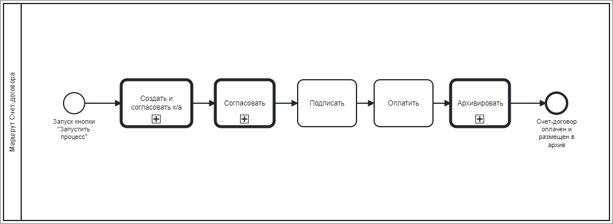
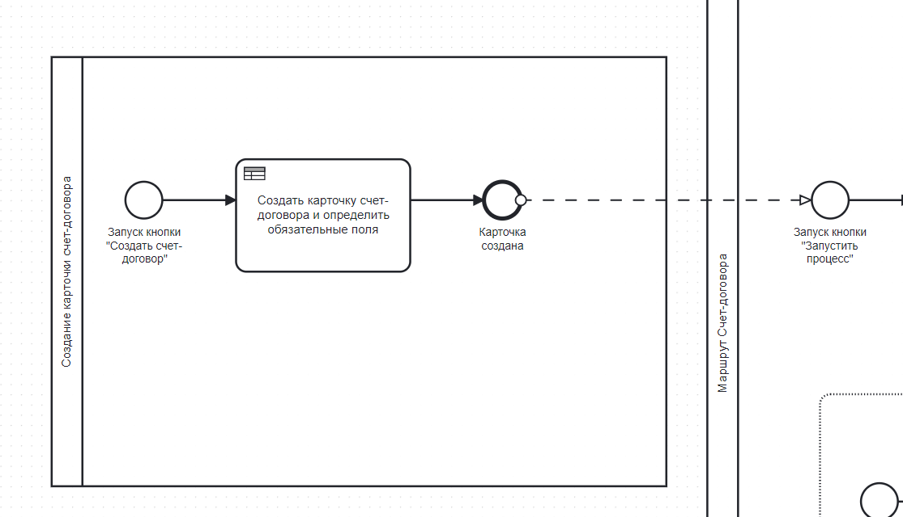
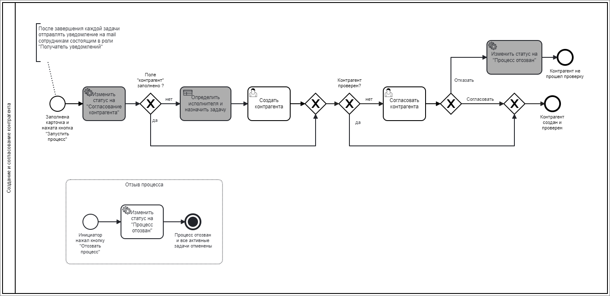
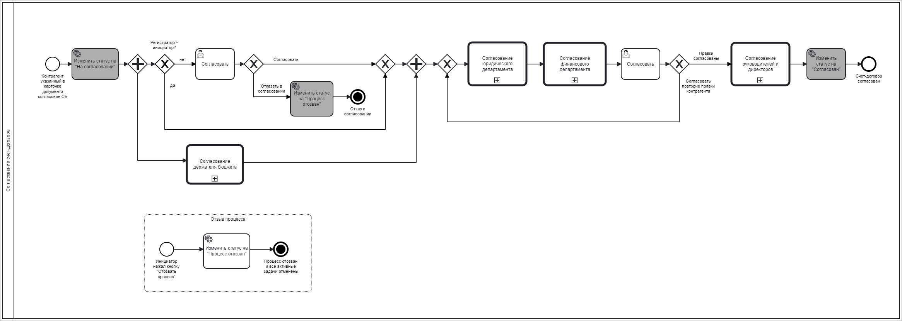
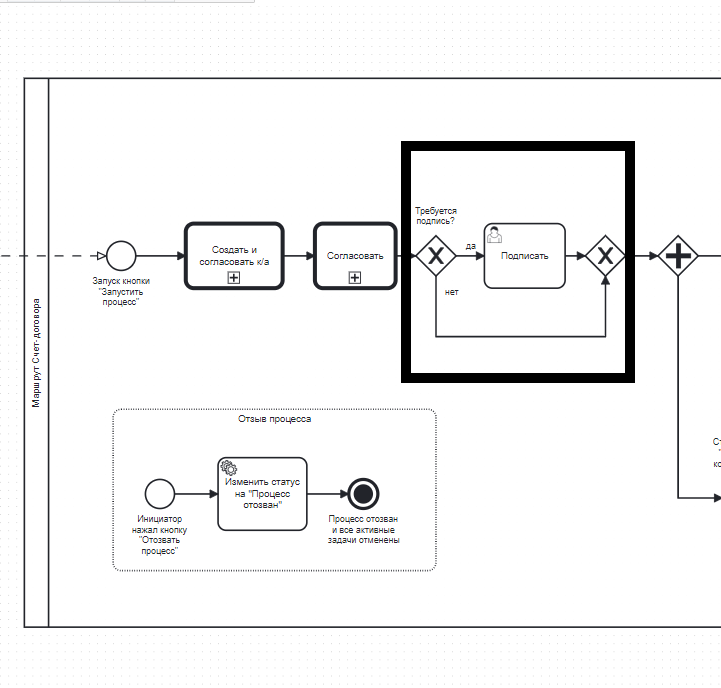
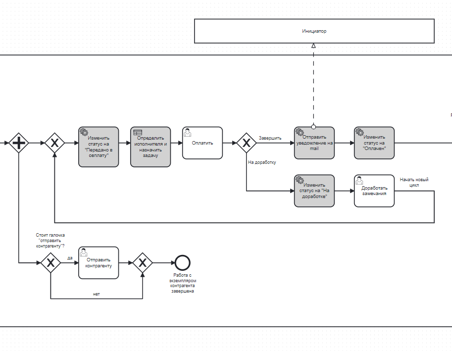
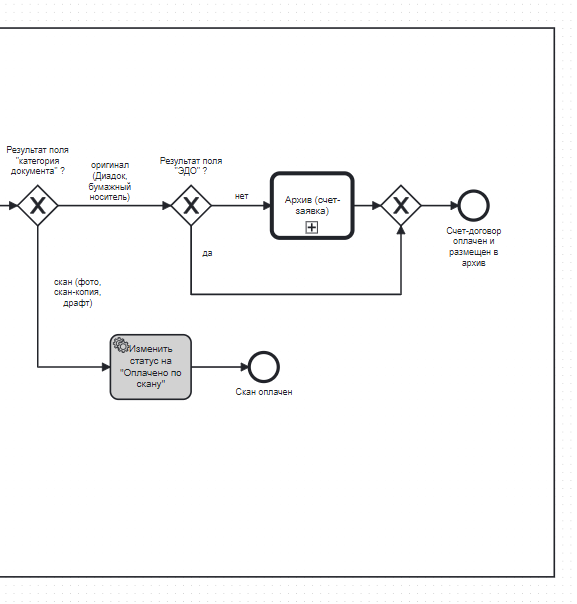

# Техническое задание на процесс "Счет-договор" в системе электронного документооборота Tessa

[Оглавление](#Оглавление)
- [Техническое задание на процесс "Счет-договор" в системе электронного документооборота Tessa](#техническое-задание-на-процесс-счет-договор-в-системе-электронного-документооборота-tessa)
- [Введение](#введение)
  - [Цель проекта](#цель-проекта)
  - [Описание процесса](#описание-процесса)
- [Основные этапы процесса](#основные-этапы-процесса)
  - [Создание карточки счета-договора](#создание-карточки-счета-договора)
  - [Создание и согласование контрагента](#создание-и-согласование-контрагента)
  - [Согласование счета-договора](#согласование-счета-договора)
  - [Подписание счета-договора](#подписание-счета-договора)
  - [Оплата и отправка контрагенту счета-договора](#оплата-и-отправка-контрагенту-счета-договора)
  - [Архив счета-договора](#архив-счета-договора)
- [Описание блоков BPMN](#описание-блоков-bpmn)
  - [Создание карточки счета-договора](#создание-карточки-счета-договора-1)
  - [Создание контрагента](#создание-контрагента)
  - [Согласование контрагента](#согласование-контрагента)
    - [Отказ в согласовании контрагента](#отказ-в-согласовании-контрагента)
  - [Согласование инициатора](#согласование-инициатора)
    - [Доработка с этапа](#доработка-с-этапа)
  - [Согласование держателя бюджета](#согласование-держателя-бюджета)
    - [Доработка с этапа](#доработка-с-этапа-1)
  - [Согласование юридического департамента](#согласование-юридического-департамента)
    - [Согласование юриста](#согласование-юриста)
    - [Согласование директора департамента юридического сопровождения бизнеса](#согласование-директора-департамента-юридического-сопровождения-бизнеса)
    - [Согласование вице-президента по правовым вопросам](#согласование-вице-президента-по-правовым-вопросам)
    - [Согласование руководителя отдела правовой поддержки операционной деятельности](#согласование-руководителя-отдела-правовой-поддержки-операционной-деятельности)
    - [Доработка в группе заданий](#доработка-в-группе-заданий)
  - [Согласование финансового департамента](#согласование-финансового-департамента)
    - [Согласование бухгалтера](#согласование-бухгалтера)
    - [Согласование главного бухгалтера](#согласование-главного-бухгалтера)
    - [Согласование руководителя отдела по финансовым расчетам](#согласование-руководителя-отдела-по-финансовым-расчетам)
    - [Согласование консультанта по налогам](#согласование-консультанта-по-налогам)
    - [Доработка в группе заданий](#доработка-в-группе-заданий-1)
  - [Проверка наличия правок](#проверка-наличия-правок)
    - [Повторное согласование правок](#повторное-согласование-правок)
    - [Повторное согласование юриста](#повторное-согласование-юриста)
    - [Повторное согласование бухгалтера](#повторное-согласование-бухгалтера)
  - [Согласование руководителей и директоров](#согласование-руководителей-и-директоров)
    - [Согласование руководителя](#согласование-руководителя)
    - [Согласование президента](#согласование-президента)
    - [Согласование финансового директора](#согласование-финансового-директора)
    - [Согласование управляющего директора](#согласование-управляющего-директора)
    - [Доработка в группе заданий](#доработка-в-группе-заданий-2)
  - [Подписание](#подписание)
  - [Оплата](#оплата)
    - [Доработка с этапа оплаты](#доработка-с-этапа-оплаты)
  - [Отправка контрагенту](#отправка-контрагенту)
  - [Архивирование](#архивирование)
    - [Передача документа в архив](#передача-документа-в-архив)
- [Требования к системе](#требования-к-системе)
  - [Общие требования](#общие-требования)
  - [Функциональные требования](#функциональные-требования)
  - [Нефункциональные требования](#нефункциональные-требования)
- [Условия завершения процесса](#условия-завершения-процесса)
  - [Успешное завершение](#успешное-завершение)
  - [Прерывание процесса](#прерывание-процесса)
- [Сроки выполнения](#сроки-выполнения)
- [Приложения](#приложения)
  - [Схема BPMN](#схема-bpmn)

# Введение

## Цель проекта

Цель данного проекта заключается в разработке и внедрении процесса "Счет-договор" в системе электронного документооборота Tessa, что обеспечит прозрачность, эффективность и снижение рисков при обработке документов.

## Описание процесса

Процесс "Счет-договор" включает создание контрагента и его проверку, если контрагент ранее не был создан в системе или был заблокирован по каким-либо причинам, согласование, подписание (по необходимости), оплату и архивацию счетов-договоров. Использование системы Tessa позволит автоматизировать и упростить данный процесс.

# Основные этапы процесса

## Создание карточки счета-договора

На данном этапе инициатор или регистратор запускает процесс создания карточки счета-договора, нажав кнопки "Создать карточку- Документы - Счет-договор” и заполняет обязательные поля.

## Создание и согласование контрагента

Процесс начинается с того, что инициатор заполняет карточку и нажимает кнопку "Запустить процесс". Если поле "Контрагент" не заполнено, система назначает исполнителя, который создаст нового контрагента, а статус меняется на "Согласование контрагента". Если поле контрагент было заполнено, но контрагент ранее заблокирован СБ, система сразу переходит к этапу проверки.

Ответственное лицо создает контрагента в системе, после чего служба безопасности проверяет нового контрагента. Если контрагент не прошел проверку, получил отказ СБ, то процесс завершается со статусом "Процесс отозван". В случае успешной проверки контрагента, он переходит на этап согласования.

Инициатор также имеет возможность отозвать процесс на любом этапе, нажав кнопку "Отозвать процесс". В этом случае статус изменяется на "Процесс отозван" и все активные задачи отменяются.

После завершения каждой задачи система отправляет уведомление на почту сотрудникам, назначенным в роли "Получатель уведомлений".

## Согласование счета-договора

Если контрагент, указанный в карточке документа, был согласован службой безопасности, статус документа изменяется на "На согласовании". 

Далее проверяется, является ли регистратор инициатором. Если да, то документ направляется только на согласование держателем бюджета. 

Если нет, то происходит параллельное согласование документа инициатором и держателем бюджета. 

В случае, если ЦФО в карточке отмечено галочкой “Документальное сопровождение”, то карточка счет-договора отправляется системой на ознакомление специалисту, который ведет документальное сопровождение выбранного направления.

В случае отказа в согласовании, статус меняется на "Процесс отозван". 

Если документ утвержден, он направляется на согласование юридического департамента, затем на согласование финансового департамента, и после этого на согласование руководителей и директоров. 

В случае внесения правок на любом из этапов, они должны быть согласованы. После всех утверждений и согласований статус документа меняется на "Согласован", что означает завершение процесса и успешное согласование счета-договора. 

Инициатор также имеет возможность отозвать процесс на любом этапе, нажав кнопку "Отозвать процесс", после чего процесс считается отозванным, а все активные задачи отменяются.

## Подписание счета-договора

Если требуется подпись, документ направляется на подписание. Если подпись не требуется документ уходит в оплату.

## Оплата и отправка контрагенту счета-договора

После согласования и, по необходимости, подписания, документ переходит в стадию оплаты. Статус изменяется на "Передано в оплату", и система определяет исполнителя, назначая ему задачу по оплате документа. После оплаты инициатору отправляется уведомление на электронную почту, а статус документа изменяется на "Оплачен" либо “Оплачено по скану” в зависимости от категории документа. Если в процессе оплаты выявляются замечания, статус меняется на "На доработке", и документ возвращается на доработку с указанием необходимых исправлений. После внесения всех корректировок документ снова проходит цикл оплаты.

Если в карточке стоит галочка "отправить контрагенту", документ отправляется контрагенту, после чего работа с экземпляром контрагента считается завершенной. В случае если галочка не установлена, процесс завершается без отправки документа контрагенту.

## Архив счета-договора

После оплаты документа проверяется значение поля "категория документа". Если документ представлен в оригинале (бумажный носитель), он направляется в архив, где происходит его окончательное размещение и хранение. Если результат поля "ЭДО" положительный, документ отправляется в архив для электронных документов.

Если документ представлен в виде скана (фото, скан-копия, драфт), процесс завершается с изменением статуса на "Оплачено по скану", и дальнейшие действия не требуются, процесс считается завершенным.

# Описание блоков BPMN

## Создание карточки счета-договора

**Действие:** Создание карточки счета-договора в системе, заполнение обязательных полей.

Возможность создания карточки имеет любой пользователь системы. 

Тот кто создал карточку отмечается как “регистратор”.

**Описание полей карточки счет-договора:**

**Вкладка "Карточка"**

*Название поля: Статус*

- Тип: Системное поле
- Описание: Статус карточки, заполняется системой, недоступно для редактирования пользователю

*Название поля: Статус изменен*

- Тип: Системное поле
- Описание: Заполняется системой, недоступно для редактирования пользователю

*Название поля: ID Карточки* 

- Тип: Системное поле
- Описание: Заполняется системой, недоступно для редактирования пользователю

*Название поля: Дата создания*

- Тип: Системное поле
- Описание: Заполняется системой, недоступно для редактирования пользователю

*Название поля: Тип документа*

- Тип: Системное поле
- Описание: Заполняется системой "счет-договор", недоступно для редактирования пользователю

*Название поля: Инициатор*

- Тип: Текстовое поле
- Обязательное поле: Да
- Описание: Поле для ввода ФИО инициатора
- Валидация: Должен содержать только буквы

*Название поля: Направление*

- Тип: Текстовое поле
- Обязательное поле: Да
- Описание: Направление инициатора, подтягивается системой из структуры

*Название поля: Тема*

- Тип: Текстовое поле
- Обязательное поле: Нет
- Описание: Тема карточки, система подставляет тип карточки "Счет - договор"

*Название поля: Комментарий согласующим/Цель оплаты*

- Тип: текстовое поле
- Обязательное поле: Да
- Описание: Существенные условия документа, описывает инициатор. Данное поле дублирует информацию во вкладку “Заявка в Бит Финанс”

*Название поля: Организация*

- Тип: Справочник
- Обязательное поле: Да
- Описание: Организация заказчика из документа

*Название поля: Контрагент*

- Тип: Текстовое поле
- Обязательное поле: Нет
- Описание: Поле можно оставить пустым, чтоб ответственный создал контрагента или выбрать контрагента из справочника

*Название поля: ЦФО*

- Тип: Текстовое поле
- Обязательное поле: Да
- Описание: ЦФО расхода

*Название поля: Номер документа*

- Тип: Текстовое поле
- Обязательное поле: Нет
- Описание: Номер документа

*Название поля: Дата документа*

- Тип: Числовое поле
- Обязательное поле: Да
- Описание: Дата из документа
- Валидация: Должен содержать только цифры

*Название поля: Сумма*

- Тип: Числовое поле
- Обязательное поле: Да
- Описание: Сумма из документа, влияет на лимиты
- Валидация: Должен содержать только цифры

*Название поля: Валюта*

- Тип: Справочник
- Обязательное поле: Да
- Описание: Пред заполнено на RUB

*Название поля: Порядок оплаты*

- Тип: Справочник.
- Варианты: Предоплата и постоплата
- Обязательное поле: Да
- Описание: Порядок оплаты из условий документа

*Название поля: НДС*

- Тип: Справочник
- Обязательное поле: Да
- Описание: НДС

*Название поля: Категория документа*

- Тип: Справочник
- Варианты: Оригинал (Диадок, бумажный носитель) или скан (фото, скан-копия, драфт)
- Обязательное поле: Да
- Описание: Категория документа, выбирается из списка

*Название поля: Получен в ЭДО?*

- Тип: Справочник
- Варианты: Да или нет
- Обязательное поле: Да
- Описание: Регистратор выбирает из справочника каким образом получен оригинал

*Название поля: Требуется подпись?*

- Тип: Справочник
- Варианты: Да или нет
- Обязательное поле: Да
- Описание: Регистратор выбирает нужна подпись нашей организации или нет

*Название поля: Отправить контрагенту*

- Тип: Чек бокс
- Описание: Устанавливается галочка, если необходимо отправить экземпляр контрагенту с нашей подписью

*Название поля: Трекномер*

- Тип: Текстовое поле
- Обязательное поле: Нет
- Описание: Вводится трекномер отправления

*Название поля: Регистратор*

- Тип: Системное поле
- Обязательное поле: Да
- Описание: Заполняется системой, ФИО того, кто создал карточку

*Название поля: Ссылки*

- Тип: Поле
- Обязательное поле: Нет
- Описание: Поле для связи карточек

*Название поля: Срочный документ*

- Тип: Чек бокс
- Описание: Для обозначения срочности

Дополнительные требования:

- Предусмотреть обработку ошибок ввода данных и оповещения пользователя о необходимости исправления.

## Создание контрагента

Тип действия - Настраиваемое  задание

Текст задания - Создать карточку контрагента или выбрать существующего

Вид - Задача

Варианты завершения:

Завершить

Еще - отложить или вернуть на роль

Условие завершения: 
Если поле контрагент пустое - выводить ошибку "Пожалуйста, выберите контрагента!"

Ответственный: Статическая роль Бухгалтер по взаиморасчетам или контекстная роль Документальный сопроводитель

Ответственный назначается по следующим условиям:

У ЦФО не проставлена галочка "документальное сопровождение":
Статическая роль - Бухгалтер по взаиморасчетам

У ЦФО проставлена галочка "документальное сопровождение":
Контекстная роль - Документальный сопроводитель
Для направления СМИ - Смирнова Т.
НЕ СМИ - Малышева М.

Документальный сопроводитель указывается в согласующих лицах для каждого направления

Срок исполнения: 1 рабочий день

## Согласование контрагента

Тип действия - Задание

Текст задания - Формирование отчёта по контрагенту

Тип задания - Карточка

Варианты завершения:

Согласовать
Отказать

Ответственный: Статическая роль Сотрудник службы безопасности

Срок исполнения: 1 рабочий день, если контрагент является резидентом и 3 рабочих дня если контрагент является нерезидентом

### Отказ в согласовании контрагента

Если на данном этапе происходит отказ в согласовании, контрагент считается заблокированным, а процесс завершается

## Согласование инициатора

Тип действия - Согласование

Текст задания - Согласовать документ, при наличии замечаний внести корректировки

Вид - Согласование

Варианты завершения:

Согласовать
На доработку

При нажатии кнопки “на доработку” обязательно к заполнению поле “комментарий”

Еще: 

Делегировать

Задать вопрос

Запросить дополнительное согласование

Отложить

Вернуть на роль

Ответственный: Контекстная роль Инициатор

Срок исполнения: 3 рабочих дня

### Доработка с этапа

После заполнения комментария и нажатия кнопки процесс завершается, а документу присваивается статус “Процесс отозван” 

Тип действия - Сигнал

## Согласование держателя бюджета

Тип действия - Согласование

Текст задания - Согласовать расход бюджета

Вид - Согласование

Варианты завершения:

Согласовать
На доработку

При нажатии кнопки “на доработку” обязательно к заполнению поле “комментарий”

Еще: 

Делегировать

Задать вопрос

Запросить дополнительное согласование

Отложить

Вернуть на роль

Ответственный: Контекстная роль Держатель бюджета

Держатель бюджета указывается в согласующих лицах для каждого направления

Срок исполнения: 3 рабочих дня

### Доработка с этапа

Тип действия - Доработка

Текст задания - Доработать документ, согласовать с контрагентом (см. комментарий согласующих)

Вид - Доработка

Варианты завершения:

Начать новый цикл

Еще:

Отложить

Вернуть на роль

Ответственный: Контекстная роль Инициатор

Срок исполнения: 30 рабочих дней

## Согласование юридического департамента

Согласование юридического департамента реализовано группой заданий

Состав согласующих и лимиты определены в карточках согласующих лиц по каждому направлению
Задачи согласования параллельные

### Согласование юриста

Тип действия - Согласование

Текст задания - Изучить договор, при наличии замечаний внести корректировки

Вид - Согласование

Варианты завершения:

Согласовать
На доработку

При нажатии кнопки “на доработку” обязательно к заполнению поле “комментарий”

Еще:

Делегировать

Задать вопрос

Запросить дополнительное согласование

Отложить 

Вернуть на роль

Ответственный: Контекстная роль Согласующие юристы

Срок исполнения: 3 рабочих дня

### Согласование директора департамента юридического сопровождения бизнеса

Тип действия - Согласование

Текст задания - Изучить договор, при наличии замечаний внести корректировки

Вид - Согласование

Варианты завершения:

Согласовать
На доработку

При нажатии кнопки “на доработку” обязательно к заполнению поле “комментарий”

Еще:

Делегировать

Задать вопрос

Запросить дополнительное согласование

Отложить 

Вернуть на роль

Ответственный: Статическая роль Директор департамента юридического сопровождения бизнеса (Кучмин А.)

Срок исполнения: 3 рабочих дня

### Согласование вице-президента по правовым вопросам

Тип действия - Согласование

Текст задания - Изучить договор, при наличии замечаний внести корректировки

Вид - Согласование

Варианты завершения:

Согласовать
На доработку

При нажатии кнопки “на доработку” обязательно к заполнению поле “комментарий”

Еще:

Делегировать

Задать вопрос

Запросить дополнительное согласование

Отложить 

Вернуть на роль

Ответственный: Статическая роль Вице-президент по правовым вопросам (Рыкова Е.)

Срок исполнения: 3 рабочих дня

### Согласование руководителя отдела правовой поддержки операционной деятельности

Тип действия - Согласование

Текст задания - Изучить договор, при наличии замечаний внести корректировки

Вид - Согласование

Варианты завершения:

Согласовать
На доработку

При нажатии кнопки “на доработку” обязательно к заполнению поле “комментарий”

Еще:

Делегировать

Задать вопрос

Запросить дополнительное согласование

Отложить 

Вернуть на роль

Ответственный: Статическая роль Руководитель отдела правовой поддержки операционной деятельности (Садыкова Ю.)

Срок исполнения: 3 рабочих дня

### Доработка в группе заданий

Если один из согласующих отправил на доработку, то у остальных задачи завершаются

Тип действия - Доработка

Текст задания - Доработать документ, согласовать с контрагентом (см. комментарий согласующих)

Вид - Доработка

Варианты завершения:

Начать новый цикл

Еще:

Отложить

Вернуть на роль

Ответственный: Контекстная роль Инициатор

Срок исполнения: 30 рабочих дней

## Согласование финансового департамента

Согласование финансового департамента реализовано группой заданий

Состав согласующих и лимиты определены в карточках согласующих лиц по каждому направлению
Задачи согласования параллельные

### Согласование бухгалтера

Тип действия - Согласование

Текст задания - Изучить договор, при наличии замечаний внести корректировки

Вид - Согласование

Варианты завершения:

Согласовать
На доработку

При нажатии кнопки “на доработку” обязательно к заполнению поле “комментарий”

Еще:

Делегировать

Задать вопрос

Запросить дополнительное согласование

Отложить 

Вернуть на роль

Ответственный: Контекстная роль Согласующие бухгалтеры

Срок исполнения: 3 рабочих дня

### Согласование главного бухгалтера

Тип действия - Согласование

Текст задания - Изучить договор, при наличии замечаний внести корректировки

Вид - Согласование

Варианты завершения:

Согласовать
На доработку

При нажатии кнопки “на доработку” обязательно к заполнению поле “комментарий”

Еще:

Делегировать

Задать вопрос

Запросить дополнительное согласование

Отложить 

Вернуть на роль

Ответственный: Статическая роль Главный бухгалтер

Срок исполнения: 3 рабочих дня

### Согласование руководителя отдела по финансовым расчетам

Тип действия - Согласование

Текст задания - Изучить договор, при наличии замечаний внести корректировки

Вид - Согласование

Варианты завершения:

Согласовать
На доработку

При нажатии кнопки “на доработку” обязательно к заполнению поле “комментарий”

Еще:

Делегировать

Задать вопрос

Запросить дополнительное согласование

Отложить 

Вернуть на роль

Ответственный: Статическая роль Руководитель отдела по финансовым расчетам

Срок исполнения: 3 рабочих дня

### Согласование консультанта по налогам

Тип действия - Согласование

Текст задания - Изучить договор, при наличии замечаний внести корректировки

Вид - Согласование

Варианты завершения:

Согласовать
На доработку

При нажатии кнопки “на доработку” обязательно к заполнению поле “комментарий”

Еще:

Делегировать

Задать вопрос

Запросить дополнительное согласование

Отложить 

Вернуть на роль

Ответственный: Статическая роль Консультант по налогам

Срок исполнения: 3 рабочих дня

### Доработка в группе заданий

Если один из согласующих отправил на доработку, то у остальных задачи завершаются

Тип действия - Доработка

Текст задания - Доработать документ, согласовать с контрагентом (см. комментарий согласующих)

Вид - Доработка

Варианты завершения:

Начать новый цикл

Еще:

Отложить

Вернуть на роль

Ответственный: Контекстная роль Инициатор

Срок исполнения: 30 рабочих дней

## Проверка наличия правок

Тип действия - Настраиваемое  задание

Текст задания - Документ прошел процесс согласования. Проверьте наличие правок в комментариях (см. вкладку "История заданий") и определите движение документа

Вид - Согласование

Варианты завершения:

Согласовать повторно правки контрагента

Правки согласованы

Еще:

Отложить

Вернуть на роль

Ответственный: Контекстная роль Инициатор

Срок исполнения: 3 рабочих дня

### Повторное согласование правок

При нажатии “Согласовать повторно правки контрагента” назначаются задачи юристу и бухгалтеру. В данный момент работает вычисление предыдущих исполнителей задач. 

Если в данном подпроцессе юрист или бухгалтер отправляют на доработку, то у параллельного исполнителя задача остается активной.

Если юрист или бухгалтер нажимают кнопку согласовать с согласованием руководителей, то задачи назначаются руководителям данных исполнителей.

### Повторное согласование юриста

Тип действия - Настраиваемое задание

Текст задания - Изучить договор, при наличии замечаний внести корректировки

Вид - Согласование

Варианты завершения:

Согласовать без руководителей

Согласовать с согласованием руководителей
На доработку

При нажатии кнопки “на доработку” обязательно к заполнению поле “комментарий”

Еще:

Отложить 

Вернуть на роль

Ответственный: Контекстная роль Согласующие юристы

Срок исполнения: 2 рабочих дня

### Повторное согласование бухгалтера

Тип действия - Настраиваемое задание

Текст задания - Изучить договор, при наличии замечаний внести корректировки

Вид - Согласование

Варианты завершения:

Согласовать без руководителей

Согласовать с согласованием руководителей
На доработку

При нажатии кнопки “на доработку” обязательно к заполнению поле “комментарий”

Еще:

Отложить 

Вернуть на роль

Ответственный: Контекстная роль Согласующие бухгалтеры

Срок исполнения: 2 рабочих дня

## Согласование руководителей и директоров

Согласование руководителей реализовано группой заданий

Состав согласующих и лимиты определены в карточках согласующих лиц по каждому направлению
Задачи согласования параллельные

### Согласование руководителя

Тип действия - Согласование

Текст задания - Согласовать документ

Вид - Согласование

Варианты завершения:

Согласовать
На доработку

При нажатии кнопки “на доработку” обязательно к заполнению поле “комментарий”

Еще:

Делегировать

Задать вопрос

Запросить дополнительное согласование

Отложить 

Вернуть на роль

Ответственный: Контекстная роль Руководитель 

Срок исполнения: 3 рабочих дня

### Согласование президента

Тип действия - Согласование

Текст задания - Согласовать документ

Вид - Согласование

Варианты завершения:

Согласовать
На доработку

При нажатии кнопки “на доработку” обязательно к заполнению поле “комментарий”

Еще:

Делегировать

Задать вопрос

Запросить дополнительное согласование

Отложить 

Вернуть на роль

Ответственный: Статическая роль Президент

Срок исполнения: 3 рабочих дня

### Согласование финансового директора

Тип действия - Согласование

Текст задания - Согласовать документ

Вид - Согласование

Варианты завершения:

Согласовать
На доработку

При нажатии кнопки “на доработку” обязательно к заполнению поле “комментарий”

Делегировать

Задать вопрос

Запросить дополнительное согласование

Ответственный: Статическая роль Финансовый директор

Срок исполнения: 3 рабочих дня

### Согласование управляющего директора

Тип действия - Согласование

Текст задания - Согласовать документ

Вид - Согласование

Варианты завершения:

Согласовать
На доработку

При нажатии кнопки “на доработку” обязательно к заполнению поле “комментарий”

Еще:

Делегировать

Задать вопрос

Запросить дополнительное согласование

Отложить 

Вернуть на роль

Ответственный: Статическая роль Управляющий директор

Срок исполнения: 3 рабочих дня

### Доработка в группе заданий

Если один из согласующих отправил на доработку, то у остальных задачи завершаются

Тип действия - Доработка

Текст задания - Доработать документ, согласовать с контрагентом (см. комментарий согласующих)

Вид - Доработка

Варианты завершения:

Начать новый цикл

Еще:

Отложить

Вернуть на роль

Ответственный: Контекстная роль Инициатор

Срок исполнения: 30 рабочих дней

## Подписание

Тип действия - Настраиваемое  задание

Текст задания, если ЭДО = да - Отправить на подпись Генеральному директору, добавить скан документа

Текст задания, если ЭДО = нет - Подписать у Генерального директора, добавить скан документа. Проставить галочку "Отправить контрагенту", если необходимо отправить документ

Вид - Задача

Варианты завершения:

Завершить

Еще - отложить или вернуть на роль

Ответственный: Контекстная роль Администратор офиса

Срок исполнения: 1 рабочий день

## Оплата

На данном этапе поле Номер заявки обязательно к заполнению. 

Тип действия - Настраиваемое  задание

Текст задания - Заполнить вкладку "Заявка в Бит Финанс" и отправить заявку для оплаты в 1С

Вид - Задача

Варианты завершения:

Завершить

На доработку

При нажатии кнопки “на доработку” обязательно к заполнению поле “комментарий”

Ответственный: Контекстная роль Роль заведение заявок

Срок исполнения: 1 рабочий день

### Доработка с этапа оплаты

Тип действия - Доработка

Текст задания - Доработать документ (см. комментарий)

Вид - Доработка

Варианты завершения:

Начать новый цикл

Еще:

Отложить

Вернуть на роль

Ответственный: Контекстная роль Инициатор

Срок исполнения: 3 рабочих дня

## Отправка контрагенту

На данном этапе поле “Трекномер” обязательно к заполнению

Тип действия - Настраиваемое  задание

Текст задания - Отправить документ контрагенту и заполнить поле "трек-номер"

Вид - Задача

Варианты завершения:

Завершить

Еще:

Отложить

Вернуть на роль

Ответственный: Статическая роль Офис-менеджер Р

Срок исполнения: 2 рабочих дня

Условие завершения:

Если поле трек-номер пустое - выводить ошибку "Пожалуйста, заполните трек-номер!"

## Архивирование

### Передача документа в архив

Тип действия - Настраиваемое  задание

Текст задания - Передать документ в архив

Вид - Задача

Варианты завершения:

Завершить

Еще:

Отложить

Вернуть на роль

Ответственный:  

Если ЦФО отмечено галочкой “документальное сопровождение”, то ответственный:  Контекстная роль Администратор офиса

Если ЦФО не отмечено галочкой “документальное сопровождение”, то ответственный: Статическая роль Специалист по документообороту РО

Срок исполнения: 7 рабочих дней

# Требования к системе

## Общие требования

**Совместимость с существующими системами**:

Система должна интегрироваться с 1С Бит Финанс 

Обеспечение взаимодействия с электронной почтой для автоматической отправки уведомлений

**Доступность и надежность**:

Время доступности системы не должно иметь ограничений

Восстановление системы после сбоя не должно превышать 2 часов

**Поддержка пользователей**:

Наличие службы технической поддержки

Инструкции и документация для пользователей

## Функциональные требования

**Управление документами**:

Возможность создания, редактирования и удаления карточек счетов-договоров

Поддержка различных типов документов (оригиналы, сканы, электронные копии)

**Создание и согласование контрагентов**:

Автоматизация процесса создания новых контрагентов

Проверка и согласование контрагентов службой безопасности

**Согласование документов**:

Маршрутизация документов для согласования инициатором, держателем бюджета, юридическим и финансовым департаментам

Возможность параллельного и последовательного согласования

**Подписание документов**:

Электронная и физическая подпись документов

Автоматическое направление документов на подпись при необходимости

**Оплата и отправка документов**:

Интеграция с системой 1С для отправки заявок на оплату

Уведомление инициаторов о статусе оплаты

**Архивирование документов**:

Автоматическое архивирование документов по завершении процесса

Разделение архива на электронный и бумажный

## Нефункциональные требования

**Производительность**:

Время отклика системы не должно превышать 2 секунд для основных операций

**Масштабируемость**:

Система должна поддерживать добавление новых пользователей и увеличения объема данных без существенных задержек

**Удобство использования**:

Интуитивно понятный интерфейс для всех типов пользователей

Настраиваемые панели и рабочие пространства

**Стабильность и поддержка**:

Регулярные обновления системы для устранения ошибок и добавления новых функций

Наличие бэкап-системы для ежедневного копирования данных

# Условия завершения процесса

## Успешное завершение

Процесс считается завершенным, когда документ размещен в архив

## Прерывание процесса

Процесс может быть прерван, если контрагент или документ не был согласован 

# Сроки выполнения

Каждый этап процесса должен выполняться в течение установленных сроков, чтобы обеспечить своевременность и эффективность обработки документов

# Приложения

## Схема BPMN

Приложенная схема BPMN визуализирует процесс и служит основой для разработки данного технического задания

Чтобы посмотреть схему необходимо зарегистрироваться в онлайн сервисе под рабочей почтой и запросить доступ к схеме у системного аналитика, если доступ к просмотру ограничен

Ссылка на сервис моделирования: [https://stormbpmn.com/](https://stormbpmn.com/)

Ссылка на главный процесс : [https://stormbpmn.com/app/diagram/d78c4adc-6ac1-48e6-8315-2b342b8e042f](https://stormbpmn.com/app/diagram/d78c4adc-6ac1-48e6-8315-2b342b8e042f)

Ссылка на подпроцесс создания и согласования контрагента: [https://stormbpmn.com/app/diagram/cf0a1bd6-892c-40d3-9ec9-3b58fc0b0981?elementId=null](https://stormbpmn.com/app/diagram/cf0a1bd6-892c-40d3-9ec9-3b58fc0b0981?elementId=null)

Ссылка на подпроцесс согласования: [https://stormbpmn.com/app/diagram/778b80a5-5c70-4482-8ece-27a63c63068d?elementId=null](https://stormbpmn.com/app/diagram/778b80a5-5c70-4482-8ece-27a63c63068d?elementId=null) 

Ссылка на подпроцесс доработки документа: [https://stormbpmn.com/app/diagram/15ad3991-acdb-4433-9870-4a4949db03a0?elementId=null](https://stormbpmn.com/app/diagram/15ad3991-acdb-4433-9870-4a4949db03a0?elementId=null) 

Ссылка на подпроцесс согласования юридического департамента: [https://stormbpmn.com/app/diagram/8e34691f-955c-4e66-8a44-514f8161f8e8?elementId=null](https://stormbpmn.com/app/diagram/8e34691f-955c-4e66-8a44-514f8161f8e8?elementId=null) 

Ссылка на подпроцесс согласования финансового департамента: [https://stormbpmn.com/app/diagram/97ec032b-f47e-40e3-a18c-d071e6b3b0ab?elementId=null](https://stormbpmn.com/app/diagram/97ec032b-f47e-40e3-a18c-d071e6b3b0ab?elementId=null) 

Ссылка на подпроцесс согласования руководителей: [https://stormbpmn.com/app/diagram/093b7c88-cf20-41ac-96e6-fd3787a4a27e?elementId=null](https://stormbpmn.com/app/diagram/093b7c88-cf20-41ac-96e6-fd3787a4a27e?elementId=null) 

Ссылка на подпроцесс архивирования: [https://stormbpmn.com/app/diagram/b8432ac5-cccd-47a7-8f38-7444c2201cb9?elementId=null](https://stormbpmn.com/app/diagram/b8432ac5-cccd-47a7-8f38-7444c2201cb9?elementId=null)